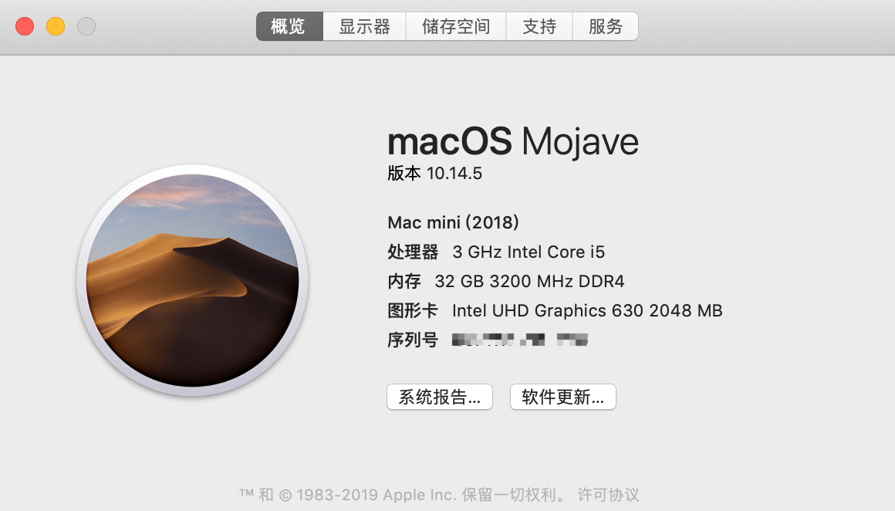

[TOC]

# z370n-wifi-hackintosh

技嘉主板（ Z370N-WIFI） 黑苹果EFI文件

假如你的主板用的和我的是一样的，那么你可以尝试直接使用这个EFI文件进行安装

所有资源都来源于网络，这是我实践后的结果副本，感谢互联网上那些为黑苹果做出贡献的所有人，当然也要感谢Apple:smile:




<!-- TOC -->

- [z370n-wifi-hackintosh](#z370n-wifi-hackintosh)
    - [目录一览](#目录一览)
    - [分支介绍](#分支介绍)
    - [硬件配置](#硬件配置)
    - [更新日志](#更新日志)
    - [安装系统](#安装系统)
    - [如何更新](#如何更新)
    - [BIOS设置](#bios设置)
    - [网卡](#网卡)
    - [蓝牙/WIFI](#蓝牙wifi)
    - [USB定制](#usb定制)
        - [Z370N-WIFI主板USB端口位置](#z370n-wifi主板usb端口位置)
    - [后续问题解决途径](#后续问题解决途径)

<!-- /TOC -->

## 目录一览

```bash
└── z370n-wifi-hackintosh
    ├── EFI       ---- MacOS引导文件
    ├── CHANGELOG.md    ---- 更新日志 
    ├── README.md   ---- README.md 
    ├── BIOS     ---- 主板相关bios(包含原始BIOS和适用于MacOS下的BIOS设置文件) 
    └── SSDT  ---- SSDT方式定制的USB patch文件
```

## 分支介绍
> 一般的 你只需要将EFI整个复制到你制作的启动U盘里的EFI分区即可,其他文件只是我的备份
> - 10.13.x  —> high-sierra
> - 10.14.x  —> mojave  
> - master  ---> 一般都是目前MacOS最新版本的配置 例如现在最新版本是mojave，master分支会和 mojave保持一致


## 硬件配置

> 包含我所知的网友的配置

| 硬件           | 型号                                            |
| -------------- | ----------------------------------------------- |
| 主板           | 技嘉 z370n-wifi                                 |
| CPU            | i5-8400 / i5-8500 / i5-8600K  /  i7-8700k                  |
| CPU散热        | 猫头鹰 NH-L9i                                    |
| 机箱(带电源)   | 立人-H80                                        |
| 蓝牙wifi(可选) |  BCM94352Z(DW1560) / BCM94360CS2                    |
| 内存           | 骇客神条16GB  / 芝奇幻光戟 32G / 海盗船 32G              |
| SSD            | Samsung SM951 512GB / Samsung 960 EVO / 970 EVO |
|显卡| RX570蓝宝石 |

## 更新日志

[查看更新日志](CHANGELOG.md)


## 安装系统

1. [安装前设置BIOS](#BIOS设置)
2. [查看安装方法](install.md)

## 如何更新

1. 复制最新的EFI文件到EFI分区即可
2. 像白果一样去`软件更新`安装更新补丁即可

- 检测更新

  

  


## BIOS设置

目前我的BIOS版本：`F10` 

- 还原BIOS配置：

> Save & Exit → Load Optimized Defaults

- 方法一：BIOS手动配置
  - 必做部分

    > BIOS > CSM Support > Disabled

如果你卡在了进度条很久都不动，例如这样


那么下面是必做操作

> BIOS > CSM Support > Disabled


- 选做部分

  (如果必做的操作可以让你顺利启动macOS那么就不用做以下操作，除非你清楚操作目的)

	- 显卡部分
	
	  根据你有无独立显卡设置
	
	  - 核显调整    
	
	     - Peripherals → Initial Display Output : IGFX
	     - Chipset → Integrated Graphics : Enabled
	     - Chipset → DVMT Pre-Allocated :128M 
	     
	  - 外置显卡调整   
	      - Peripherals → Initial Display Output : PCIe 1 Slot
	      - Chipset → Integrated Graphics : Disabled
	  
	- 其他部分
	
	   - BIOS > Windows 8/10 Features > Windows 8/10
	
	   - BIOS > Secure Boot > Disabled
	
	   - Peripherals > Intel Platform Trust Technology (PTT) > Disabled
	
	   - Peripherals > USB Configuration > Legacy USB Support > Enabled
	
	   - Peripherals > Network Stack Configuration > Network Stack > Disabled
	
	   - Peripherals > USB Configuration > XHCI Hand-off > Enabled
	
	  
	
	   - Chipset > DVMT Pre-Alloc > 128M
	   - Chipset > DVMT Total Gfx Mem > 256M
	   - M.I.T > Extreme Memory Profile (X.M.P.) > Profile 1
	   - Chipset > Vt-d > Disabled
	   - Chipset > Above 4G Decoding > Enabled

- 方法二：导入BIOS配置文件

  我提供了已经配置好的BISO设置文件，你可以选择导入我配置的BIOS文件

> **PS**:  
>
> - 一定要对应BIOS版本
> - 我的版本只是用核显没有独立显卡

1. 开机狂按`Del`进入BIOS界面
2. 切换到`Save&Exit` 选择 `Load Profiles`，在弹出的对话框内选择对应的BIOS文件
3. 出现`Profile Loaded`窗口后，点击`Save&Exit Setup`退出BIOS重启


## 网卡

- 左侧网口 

    > `IntelMausiEthernet.kext`
- 右侧网口 

    > `SmallTree-Intel-211-AT-PCIe-GBE.kext`

## 蓝牙/WIFI

默认的主板上的蓝牙/WIFI网卡不能用于黑苹果。你需要更换为兼容的网卡，有两块网卡能够兼容黑苹果：

- 原装网卡BCM94360CS2 

> 此款网卡原生驱动 不需要添加第三方驱动

- Dell的DW1560(具体型号为BCM94352Z) 
> 这块网卡需要添加相应驱动，参考黑果小兵版主的[教程](https://blog.daliansky.net/Broadcom-BCM94352z-DW1560-drive-new-posture.html)设置

## USB定制

> EFI里默认的使用方式是`Hackintool`软件制作,
如果你要自定义更加符合你机箱上的USB端口排列，任选下面其中一个方法即可，你只需要根据自己需要增删相应端口即可,Z370N-WIFI所有的USB端口已经全部标记出来了
[点我查看](#Z370N-WIFI主板USB端口位置)

> 要确保USB总共的USB端口在`15`个以内(含)，一个USB3.0就占用两个端口，用3.0的需求应该比2.0的多点吧，所以结合你自己的实际需要，你可以屏蔽USB3.0上的2.0端口以获取更多可用的USB3.0端口

**USB有两种方法**

- [Hackintool定制](<https://blog.daliansky.net/Intel-FB-Patcher-tutorial-and-insertion-pose.html>)


  > 将生成的两个文件复制到指定位置

  - `SSDT-EC.aml` 复制到 `EFI/CLOVER/ACPI/patched`
  - `USBPorts.kext`复制到`EFI/CLOVER/kexts/Other`


  这种方式比较容易定制符合自己机箱的端口

- [SSDT定制](https://www.tonymacx86.com/threads/guide-creating-a-custom-ssdt-for-usbinjectall-kext.211311/)

  > 将SSDT文件夹里的复制到指定位置
  
  - `SSDT-UIAC.aml` 复制到 `EFI/CLOVER/ACPI/patched`
  - `USBInjectAll.kext`复制到`EFI/CLOVER/kexts/Other`

本质上两者应该没啥区别 只是定制的难易程度 我瞎猜的:smiley:

**以下是我目前定制的USB端口**


### Z370N-WIFI主板USB端口位置


## 后续问题解决途径

- [Google is your good friend](https://www.google.com)
- [黑果小兵博客](https://blog.daliansky.net)
- [远景论坛](http://pcbeta.com)
- [insanelymac](https://www.insanelymac.com)
- [tonymacx86](https://www.tonymacx86.com)

